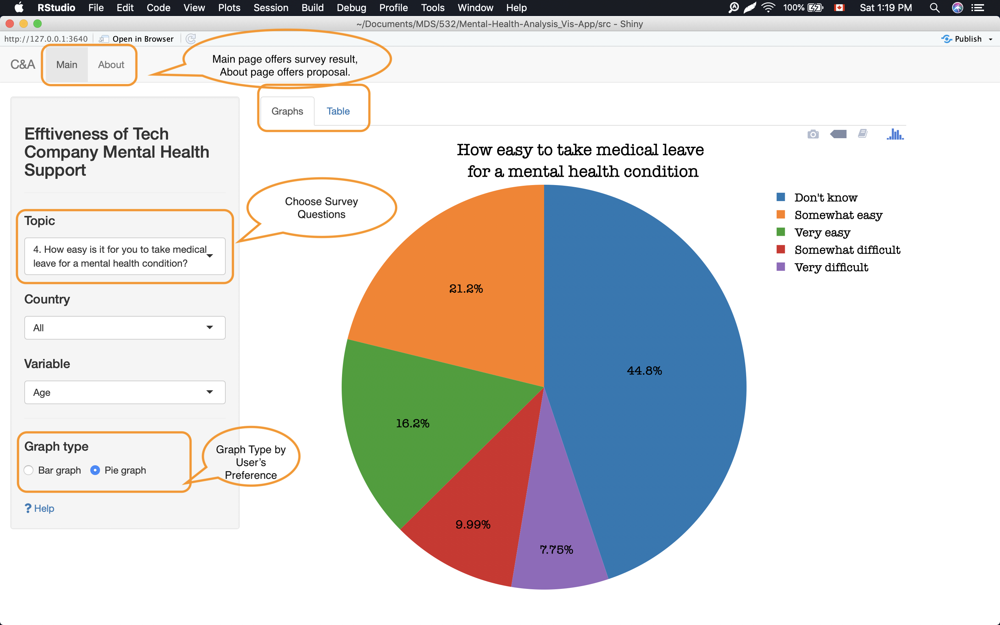
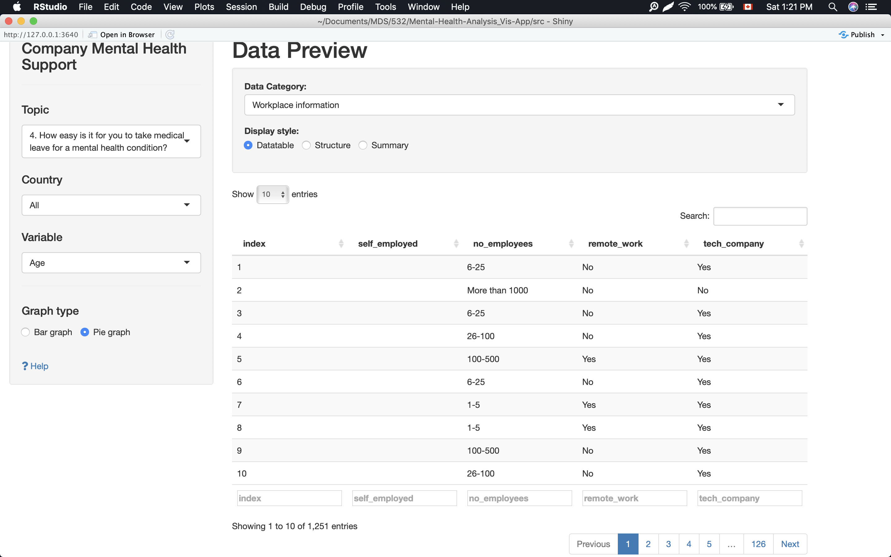

# Milestone 2 Writeup

Author: Albert Yu, Chao Wang

### 1.0 Design Philosophy:

We followed the dashboard design rule of thumb: key information displayed first, on top of the screen, in the upper left-hand corner. The options are given to the user to navigate the app in the left sidebar panel. There is some scientific wisdom behind this placement – most cultures read their written language from left to right and top to bottom, which means that people intuitively look at the upper-left part of a page first. Through the use of dropdown menus and radio buttons we are able to customize the app interface to individual user cases, while offering flexibility of visualization choices, and providing granular details to provide a neat look. The main tab displays the big picture, and the graph tab reflects the survey results according to the user's choice, while the table sections show the overall results.

### 2.0 Tasks: 
#### 2.1 Tells a clear story:  
Users are landed on the main page, graph tab. In order to display results neatly and logically, the **Topic Drop Menu** enables users to select survey topics that are relevant to their user case. 

Bar charts are chosen to be the primary visual encoder as humans react to length change the best compared with other pattern changes. Due to the fact that survey results are categorical data, bar charts can quickly compare items in the same category, for example, the number of employers providing mental health care programs. Again, such charts are easy to understand as they are clear and compact.

Users can alter the graph type to pie chart through the **radio button** on the side panel. Pie charts can be instantly scanned and users will notice the biggest slice immediately. On the side panel, users are allowed to filter the data display based on country and input variable. Two positions of bar, stack and dodge,  are available to be customized according to user preference.

#### 2.2 Simplifies Complexities: 
The survey results have been broken down into 5 individual reports. By selecting the data categories on the side panel, a specific aspect of the mental health survey results will be displayed. The **page length options** and **sorting options** give flexibility, while maintaining the tidy look of the app. We offer three **display styles**: data table, data structure, and data summary. 

### 3.0 Reflection: 

#### 3.1  Staying close to our vision and mission: 
Our vision is to foster a better work environment, increase productivity, and reduce operating cost. Our app is able to demonstrate the low awareness of care programs and the importance of support anonymity in the workplace. 

Although our goal remains the same, we trimmed down our user scenarios from two to one. This is because of precision, and the targeting the right audience. An HR Vice President deciding on group benefit plans needs different data than a startup owner deciding on an office rental. We focus on the company’s mental health support, and awareness of the mental health support program. On the other hand, we want to answer their questions clearly and give users autonomy to dive deep into the details they need. Users could use the **search bar** to only select U.S. data if they wanted, as a human resource professional in the United States would likely not be interested in the results of companies in the Czech Republic. 

Comparing with our App sketch last week, our app displays one chart at one screen instead of four for the sake of brevity. Help button directs user to our github repo, this way we get rid of the github button to achieve minimalism.

### 4.0 Bugs: 

So far, no bugs detected. We welcome feedbacks from TAs and MDS students.

## 5.0 Reference: 
1. *How to Create Documentation for Dashboards*.\[online\] Available at:<https://chartio.com/learn/dashboards-and-charts/how-to-create-documentation-for-dashboards/>.\[Accessed 16 Jan. 2019\]
2. *10 Dashboard Design Principles & Best Practices To Enhance Your Data Analysis*.  \[online\] Available at: <https://www.datapine.com/blog/dashboard-design-principles-and-best-practices/>. \[Accessed 16 Jan. 2019\]
3. *User Experience Design*. \[online\] Available at:<https://www.interaction-design.org/literature/topics/ux-design>\[Accessed 16 Jan. 2019\]
4. *Dashboard Design Best
Practices – 4 Key Principles*\[online\] Available at: <https://www.sisense.com/blog/4-design-principles-creating-better-dashboards/> \[Accessed 19 Jan. 2019\]
