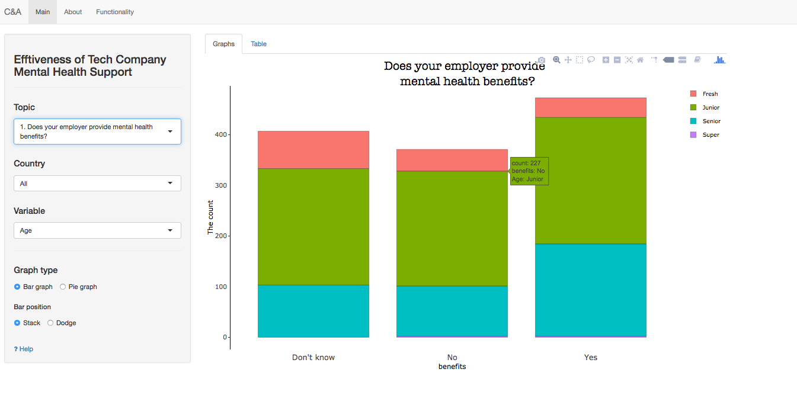
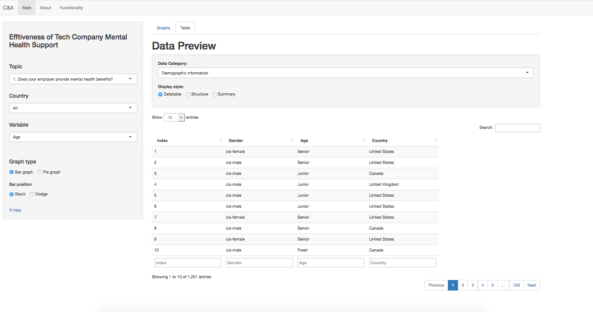

# Milestone 2 Writeup

Author: Albert Yu, Chao Wang

### 1.0 Design Philosophy:

We followed the dashboard design Rule of Thumb: key information displayed first, on top of the screen, upper left-hand corner. The options are given to the user to navigate the app on the left sidebar panel. There is some scientific wisdom behind this placement – most cultures read their written language from left to right and top to bottom, which means that people intuitively look at the upper-left part of a page first. Through the use of dropdown menus, radio buttons, we are able to customize the survey reuslt to user cases, offer flexibility of visualization choices, and provide granular details while providing a neat look. The main tab displays the big picture, the graph tab reflets the survey results according to user's choice. The table sections show the overall results.

#### 1.1 Tells a clear story:  
Users are landed on the Main page, graph tab. In order to display results neatly and logically, the **Topic Drop Menu** enable users to select survey topics are relavant to their user case. 

Bar charts are chosen to be the primary visual encoding as human reacts to length change the best comparing with other pattern changes.Due to the fact that survey results are categorical data, bar charts can quickly compare items in the same category, for example, the number of employers providing mental health care program. Again such charts are easy to understand, clear and compact.

Users can alter the graph type to pie chart through the **radio button** on the side panel. Pie charts can be instantly scanned and users will notice the biggest slice immediately. 

#### 1.2 Makes the complex simple: 
The survey results has been broken down to 5 individual reports. By selecting the Data Categories on the side panel, a specific aspect of the mental health survey results will be displayed. The **page length options** and **sorting options** give flexibility while maintaining a tidy look of the App. 

### 2.0 Reflection: 

#### 2.1  Stay close to our vision and mission: 
Our Vision is to forester a better work environment, increase productivity and reduce operating cost. Our app is able to demonstrate the low awareness of care programs and the importance of support anonymity in the workplace. 

Although our goal stays the same, we trim down our user scenarios from two to one. This is because of precision and the right audience targeting. An HR Vice President deciding on group benefit plan need different data than a startup owner deciding on office rental. We focus on the company’s mental health support and awareness of the mental help support program. On the other hand, we want to answer their questions clearly and give users autonomy to choose dive deep to the details they need. Users could use the **search bar** to only select U.S. data. An HR in the United States not necessarily interested in the results in the Czech Republic. 

## 3.0 Reference: 
1. *How to Create Documentation for Dashboards*.\[online\] Available at:<https://chartio.com/learn/dashboards-and-charts/how-to-create-documentation-for-dashboards/>.\[Accessed 16 Jan. 2019\]
2. *10 Dashboard Design Principles & Best Practices To Enhance Your Data Analysis*.  \[online\] Available at: <https://www.datapine.com/blog/dashboard-design-principles-and-best-practices/>. \[Accessed 16 Jan. 2019\]
3. *User Experience Design*. \[online\] Available at:<https://www.interaction-design.org/literature/topics/ux-design>\[Accessed 16 Jan. 2019\]
