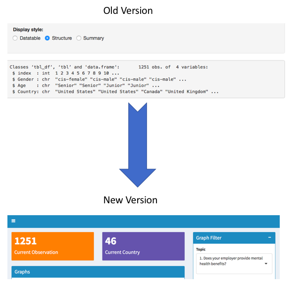
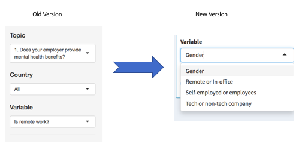

# Milestone 2 Writeup

Author: Chao Wang, Albert Yu,

## 1.0 Reflection on the usefulness of the feedback you received.

### 1.1 Usability of our app
We absolutely appreciate the feedback lab session, especially two cycles of peer reviews. One group has the same topic, the others don’t. The background knowledge level difference between the two groups provided us with feedback from the perspective of fresh users and educated users.

### 1.2  Similar feedback from both groups
We are suggested to remove data structure, focus on the user case instead of the developers as data structure is for more R-savvy developers. In our case, a big picture sum up would be more appropriate for HR directors. Thus, we replaced the old R-data structure with a sum up on the top of the dashboard.

### 1.3 The most valuable feedback
One of the most important takeaways is that our design and wording should be clear to users that are fresh to the app and the topic. For example, we segmented age by 5 groups labeled as “fresh, junior, senior and super”. Thought it seems to be clear to us that we divided ages into 4 groups but this might not make sense to users. Thus, we replaced the age groups with a scented widget, a histogram(visual scent) shows the age distribution while the widgets allow users to filter.

### 1.4 Unreasonable expectation
One expectation that is difficult to satisfy is that it is hard to hover over the correct group when there is only one count in a group on our stack bar graph. After consulting the TA and searching on the internet, there is no way to magnify the “one count bar size” other than log scale. We tackle this issue by providing dodge style bar chart.

### 1.5 "Fly on the wall"
The "fly on the wall" session emulates the real world scenarios---apps users are new to the interface, developers would not have a chance to explain the usage of the app, which means our design should be intuitive and simple. Through this session we received question regarding the difference between topic and variable. Users are confused with selecting two questions. In our new version, we make variable names to statements so that users could focus on choosing the survey topic.

## 2.0 Reflection on how your project has changed since Milestone 2, and why.

###2.1 Dashboard design choice
Although our objective and functionality mostly remain the same, we rolled out changes so to enhance user experience. Originally, we split the interface into two main sections and two tab views---side panel and main interface, graph tab and table tab. In the newer design, we moved tabs to the left side panel and created graph filter options in the widgets on right hand side.

### 2.2 User scenarios
Originally we focused on demonstration on US survey results, we aggregated all other countries in the same group. The “other” group turned out to be ambiguous to users, users are unable to find out which countries’ results are included, users also want to explore the survey results of other countries. To address this issue, our new version allows users to select and deselect countries while US remains the default selection when only one country is selected.

### 2.3 Detail Enhancement
Collapse box design are added for sake of brevity. It keeps the necessary content on the page while keep the dashboard clean.

### 2.4 time constraints
Big kudos to team member Albert, we are able to implement all the changes we wanted!

## 3.0 Reference:
1. *A Comprehensive Guide To Mobile App Design*.\[online\] Available at:<https://www.smashingmagazine.com/2018/02/comprehensive-guide-to-mobile-app-design/>.\[Accessed 26 Jan. 2019\]
