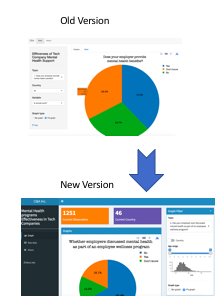

# Milestone 3 Writeup

Author: Chao Wang, Albert Yu,

# 1.0 Reflection on the feedback

### 1.1 Usability of our app

We absolutely appreciate the feedback lab session, especially two cycles of peer reviews. 

| Team  | Feedback |
| :------: | :---: |
|ellognea-ptung-mental-health | [link](https://github.com/UBC-MDS/Mental-Health-Analysis_Vis-App/issues/28) | 
|DSCI-532-wine-data           | [link](https://github.com/UBC-MDS/Mental-Health-Analysis_Vis-App/issues/27) |

During the review session, our reviewers had no critical issues exploring through our application without any explanation from us, which implies the functionality of the application is self-explaining to a certain extent. They thought this application provides good insight into the mental health support for Tech companies. The features, such as interactive plot and help link, really helped them navigate the App without any introduction. However, we also received several feedbacks about what we should improve in Milestone 3.

### 1.2  Similar feedback from both groups

One of the common themes was that the data structure display is less useful for the general public as data structure is for more R-savvy developers. However our taget audiences are HR directors. Another common theme is the vagueness of the variables. For example, our age group was divided into four sub-groups, fresh (age 16-24), junior (age 25 -34), senior (age 35 - 60) and super (age > 60), which were not explicitly shown on the application. On the filter panel, the reviewers felt it was unclear which countries the “Other” option denotes. These issues reduced the readability thus prevented the reviewers from understanding the application. Overall, we thought these reviews are reasonable and we are definitely able to improve the functionality and visualization of our application.

### 1.3 Fly on the wall

The “fly on the wall” session emulated the real world scenarios—apps users are new to the interface, developers would not have a chance to explain the usage of the app, which means our design should be intuitive and simple. We felt that the process is useful and interesting. We understood that minor details can have a significant negative impact on user experience. One significant lesson we learned is that we should always design our application from the perspectives of users. 

### 1.4 The most valuable feedback

One of the most important takeaways is that our design and wording should be clear to users that are fresh to the app and the topic. For example, we segmented age by 5 groups labeled as “fresh, junior, senior and super”. Thought it seems to be clear to us that we divided ages into 4 groups but this might not make sense to users. Thus, we replaced the age groups with a scented widget, a histogram(visual scent) shows the age distribution while the widgets allow users to filter.

### 1.5 Challenge

One expectation that is difficult to satisfy is that it is hard to hover over the correct group when there is only one count in a group on our stack bar graph. After consulting with the TA, there is no way to magnify the “one count bar size” other than log scale. We decided to tackle this issue by providing dodge style bar chart.

## 2.0 Reflection on the update

###2.1 Dashboard design choice
Although our objective and functionality mostly remain the same, we rolled out changes so to enhance user experience. Originally, we split the interface into two main sections and two tab views---side panel and main interface, graph tab and table tab. In the newer design, we moved tabs to the left side panel and created graph filter options in the widgets on right hand side.

### 2.2 User scenarios
Originally we focused on demonstration on US survey results, we aggregated all other countries in the same group. The “other” group turned out to be ambiguous to users, users are unable to find out which countries’ results are included, users also want to explore the survey results of other countries. To address this issue, our new version allows users to select and deselect countries while US remains the default selection when only one country is selected.

### 2.3 Detail Enhancement
Collapse box design are added for sake of brevity. It keeps the necessary content on the page while keep the dashboard clean.

### 2.4 time constraints
Big kudos to team member Albert, we are able to implement all the changes we wanted!

## 3.0 Reference:
1. *A Comprehensive Guide To Mobile App Design*.\[online\] Available at:<https://www.smashingmagazine.com/2018/02/comprehensive-guide-to-mobile-app-design/>.\[Accessed 26 Jan. 2019\]
