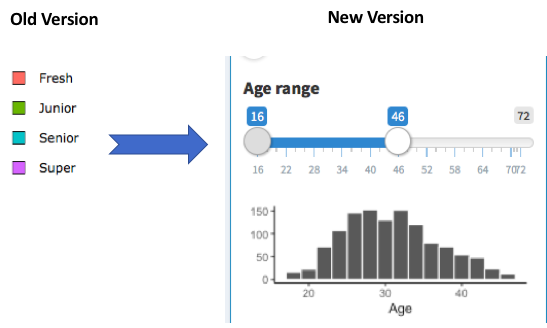
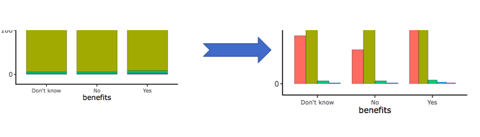
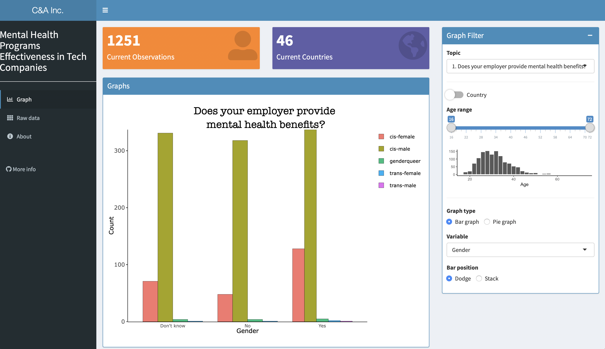
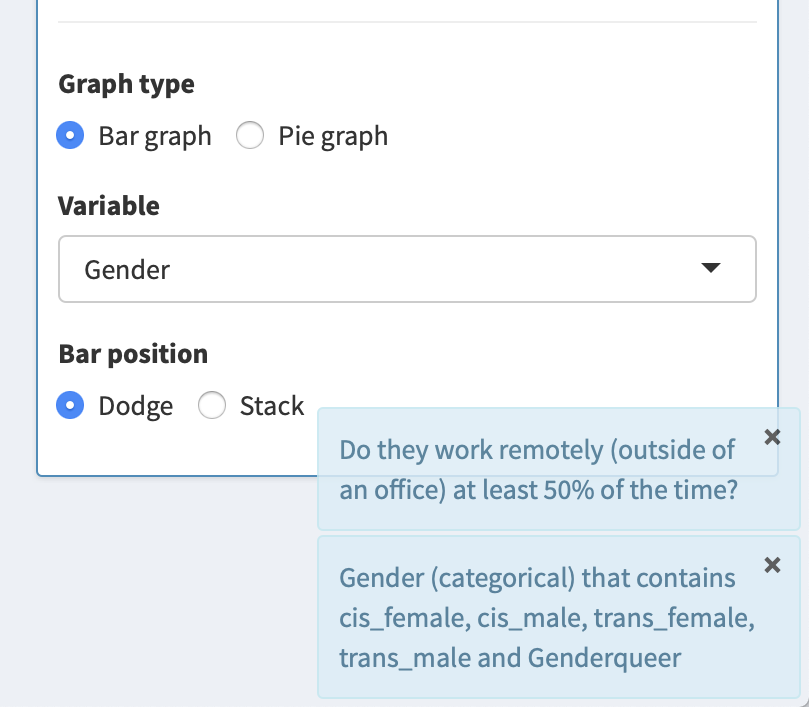
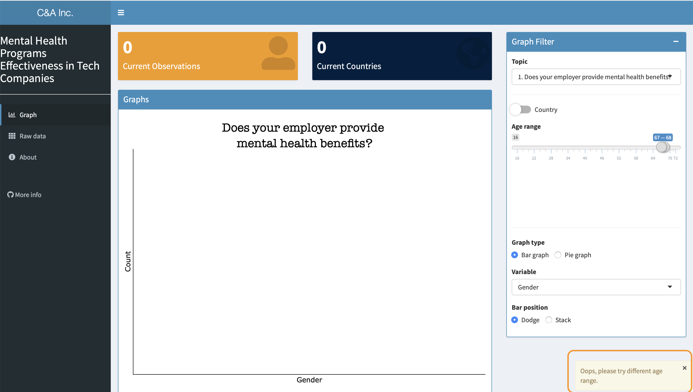
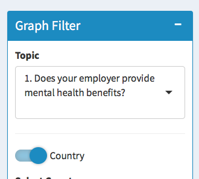
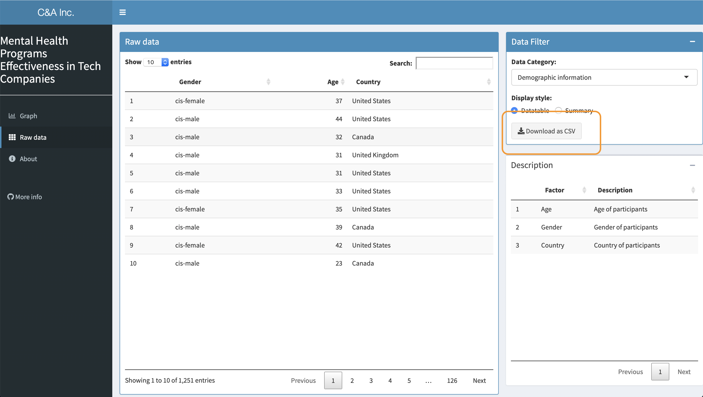

# Milestone 3 Writeup

Author: Chao Wang, Albert Yu

# 1.0 Reflection on the feedback

### 1.1 Usability of our app

We absolutely appreciate the feedback lab session, especially two cycles of peer reviews.

| Team  | Feedback received |
| :------: | :---: |
|ellognea-ptung-mental-health | [issue link](https://github.com/UBC-MDS/Mental-Health-Analysis_Vis-App/issues/28) |
|DSCI-532-wine-data           | [issue link](https://github.com/UBC-MDS/Mental-Health-Analysis_Vis-App/issues/27) |

During the review session, our peers had no difficulties navigating our application without any explanation from us. This implies our app is self-guided. They thought our app provides good insight on the mental health support of tech companies. The interactive plot and help link really helped them navigate the App without any introduction. However, we also received several feedbacks about what we should improve in Milestone 3.

### 1.2  Similar feedback from both groups

One of the common themes was that the data structure display is less useful for the general public(and HR directors) as data structure is for more R-savvy developers.

Another common theme is the ambiguity of the variable names. For example, we segmented ages into four sub-groups, fresh (age 16-24), junior (age 25 -34), senior (age 35 - 60) and super (age > 60). These groups were not explicitly shown on the application. On the filter panel, the reviewers felt it was unclear which countries the “Other” option denotes. These issues reduced the readability, it prevented the reviewers from understanding the application. Overall, we thought these reviews are reasonable and we can definitely improve the functionality and visualization of our application.

### 1.3 "Fly on the wall" session

The “fly on the wall” session emulated the real world scenarios—-apps users are new to the interface, developers would not have a chance to explain the usage of the app. This requires our design should be intuitive and simple. We think the process is helpful and interesting. We understood that even a misleading minor detail can have a significant negative impact on user experience. One key lesson we learned is that we should always design our application from the perspectives of users.

### 1.4 The most valuable feedback

One of the most important takeaways is that our design and wording should be clear to users that are fresh to the app and the topic. To address to the age segmentation feedback, we replaced the age groups with a **scented widget**, a histogram(visual scent) shows the age distribution while the widgets allow users to filter.

### 1.5 Challenge

One expectation that is difficult to satisfy is that it is hard to hover over the correct group when there is only one count in a group in our stack bar graph. After consulting with the TA, there is no way to magnify the “one count bar size” other than log scale. We decided to tackle this issue by providing dodge style bar chart.

## 2.0 Reflection on the update

### 2.1 Dashboard design choice

Although our objective and functionality mostly remained the same, we rolled out changes to enhance user experience. Originally, we split the interface into two main sections and two tab views---side panel and main interface, graph tab and table tab. In the newer design, we moved tabs to the left side panel and created graph filter options in the widgets on right hand side.

### 2.2 User scenarios

Originally we focused on the demonstration on US survey results so that we aggregated all other countries in the same group. The “other” group turned out to be ambiguous to users. Users were unable to find out which countries’ results are included. Users also wanted to explore the survey results of other countries. To address this issue, our new version allows users to **select** and **deselect** countries while US remains the **default selection** when only one country is selected.

### 2.3 Detail Enhancement

A **message notification system** was implemented to help users better explore the application. For example, when users select a variable value, a message box will pop up offering descriptions to the corresponding variable.

A **warning system** was built to guide users to select available data range.

On the data page, a **download button** was added for users to continue their work locally. We also implemented a **factor description table** in order to help users understand better.

Both data filter panel and description table are **collapsible** to maintain a clean visualization.

# 3.0 Conclusion

In conclusion, the object of our app remains the same and we have significantly improved the functionality and the visualization of our app based on the useful feedbacks received from our peers and TAs. We built a complete new version of our application including a dashboard page. We provided more options for users to customize their web page by implementing a age slider and a country selector as well as removed the ambiguity. A notification and warning system are embedded to offer more guidance to users. Lastly, we re-organized our widgets to enhance the aesthetic of the app.

# 4.0 Reference

1. *A Comprehensive Guide To Mobile App Design*.\[online\] Available at:<https://www.smashingmagazine.com/2018/02/comprehensive-guide-to-mobile-app-design/>.\[Accessed 26 Jan. 2019\]
