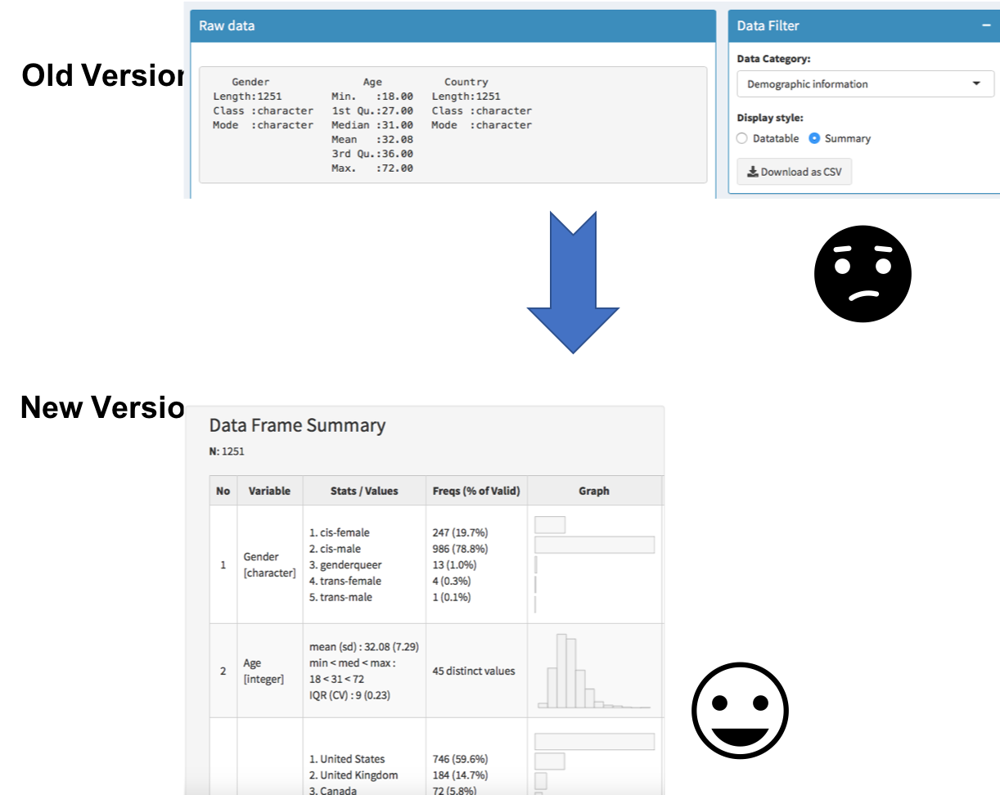
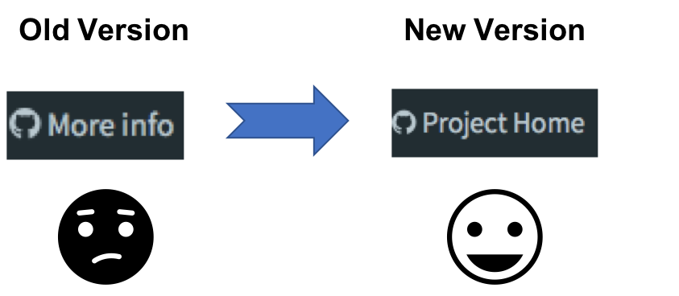
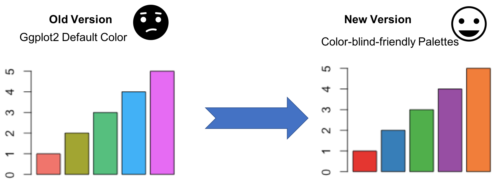
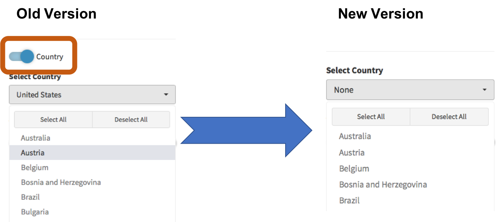
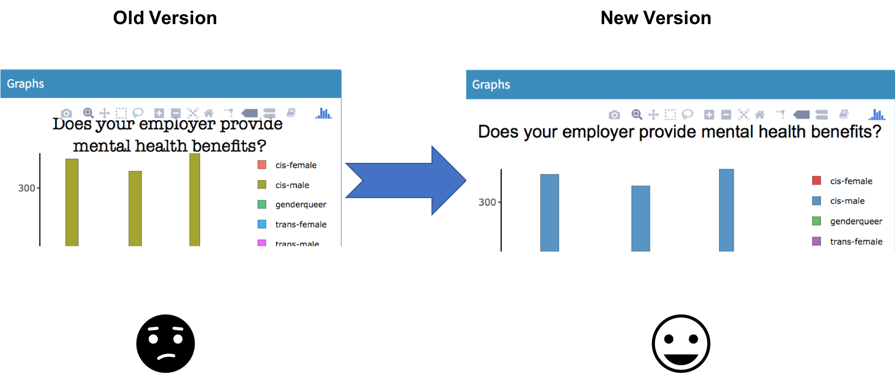
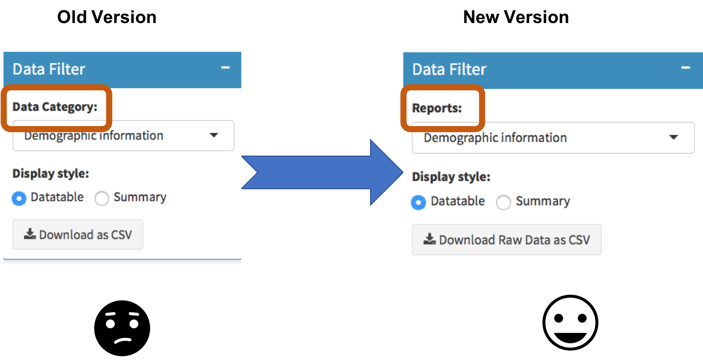

# Milestone 4 Writeup

Author: Chao Wang, Albert Yu

## 1.0 Introduction 

During the last milestone project, we have made a great improvement in our shiny App with several updates given the time limit. In this write-up, we discuss what we would do differently if we have another chance to start over. In the end, we also conclude the biggest challenges we encountered in making the final product.

## 2.0 Changes Made

#### 2.1 Change R-styled summary to a summary table.

Rationale: the previous version of the summary is plain-data-focused. It is hard for non-technical users to understand. The new version of **Data Frame Summary** increases readability as well as offers more tabular visualization, which is more friendly to the general public.

#### 2.2 Add notes on variable names.
 

Even though we hide the variable selections in the pie chart display, it was still not very clear to users when and where they can apply variable selections. Hence, we added more notes to explain that variable selection is only applicable to bar charts.

#### 2.3 Change download csv to download raw data as csv.

Because users can choose either data table view or summary view, the “Download as CSV” may lead to some confusions which view is available for downloading. We changed the button label to “Download Raw Data as CSV” to clarify that only the survey result raw data can be saved as CSV.

#### 2.4 Change "More info" to "project source/project home".

In accordance with the TA’s feedback, “Project Home” is a better description for redirecting users to our GitHub repo.

#### 2.5 Change the default plot color palette to a color-blind-friendly palette that matches the overall app design.

To make our Shiny App even more user-friendly, we replaced the ggplot2 default color palettes with a color-blind-safe palette from Color Brewer package. The new color palette also matches the overall Shiny theme color.

#### 2.6 Remove redundant material switch(Country).

As per TA suggested, we removed the material switch as it is more or less redundant in our case.

#### 2.7 Replace the warming message to a pop-up Shiny Alert.

In our previous version, the warning message is displayed at the right bottom of the dashboard for only 1.5 seconds. In our newest update, we implemented a Shiny Alert in the middle of the page with 3 seconds duration. The bigger size and the better position allows users to be more alert that they need to change their invalid data selections.

#### 2.8 Change font to avoid overlap with bar plot.

We changed the title font from to American Typewriter to Arial to allow fair margin between the title and the graph. 

#### 2.9 Change "Data Category" to a more intuitive label.

During a focus group test, we noticed that users don’t know how to use the “Data Category” button to select alternative reports. We replaced the previous label with “Reports” to better guide users. 

## 3.0 If you were to make the app again from scratch, what would you do differently?

We probably would choose another data set. This survey dataset only has categorical data that have little varieties. Suppose we choose a dataset with a time series component (we only have time stamps of the survey taken time, it make no sense to plot a timeline), we would be able to include visualization diversity into our app.

Shiny is fast to learn, easy to deploy, we wish to use other languages like HTML, CSS, and Javascript to create our app next time. That way, we have more freedom and flexibility. It might be even more time consuming though.

## 4.0 What were the greatest challenges you faced in creating the final product?

Due to the heavy workload, we struggle to try out all the available Shiny widgets. Going forward, we would like to try all other widget options. 

We would like to make our app more interactive. We really love the Shiny Alert package. It would be better to implement more animations in our app.

If time allows, we may design our app based on shinydashboard Plus.

The compatibility between ploty and ggplot2 was an issue. Plotly can’t render subtitle or captions from ggplot2. This limit us regarding what and where we'd place our graph. With better compatibility, we would be able to increase the margin between th graph title and the graph, adding side notes to explain the graph etc. 

Overall, we are happy with what we have developed within such a short time frame. 

## 5.0 Reference

1. *shinyalert: Easily create pretty popup messages (modals) in Shiny*.\[online\] Available at:<https://deanattali.com/blog/shinyalert-package/>.\[Accessed 28 Jan. 2019\]
