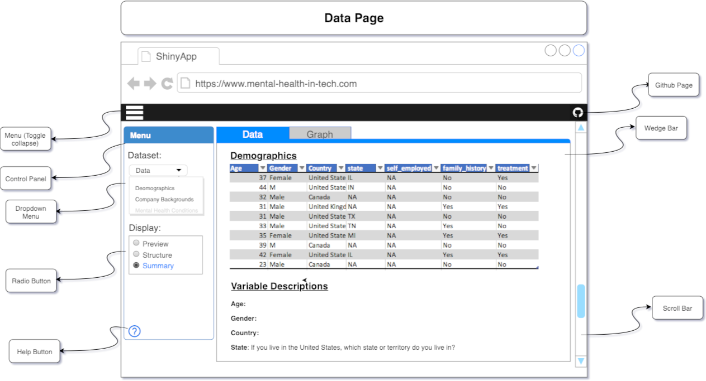
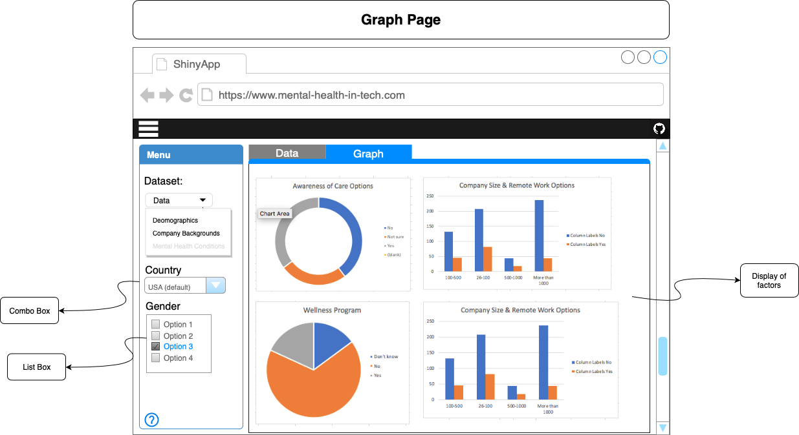

# Tech Mental Health Survey App 

# 1.0 Overview

# 2.0 Description of the data

We will visualize a dataset that contains 1295 subjects who participated in the Tech Mental Health Survey in 2014 in the worldwide. The survey examined 24 main factors associated with mental health status (excluding timestamp, state and comments) . We clusters the factors into five main categories based on the type of survey questions. Each survey result contains the demographic information (age, gender and country), mental health condition (family history, treatment and work interfere),  workplace information (number of employees, allow remote work, company type etc), organizational mental health supports (benefits, care options, wellness program etc) and their openness about mental health issues at work.  The results of most survey questions are either yes or no. Some of questions contain scale results. The following is the questions listed in the survey.

#### Category 1. Demographic information

| Factor  | Description  | type | 
|---|---|---|
|Age| Age of participator  |  numeric  | 
|Gender| Gender of participator  | categorical | 
|Country  | Country of participator  | categorical |  

#### Category 2. Mental health condition 

| Factor  | Description  | type | 
|---|---|---|
|family_history | Do you have a family history of mental illness? | categorical |
|treatment | Have you sought treatment for a mental health condition? | categorical |
|work_interfere |  If you have a mental health condition, do you feel that it interferes with your work? | categorical |

#### Category 3. Workplace information

| Factor  | Description  | type | 
|---|---|---|
|self_employed | Are you self-employed? | categorical |
|no_employees | How many employees does your company or organization have? | categorical |
|remote_work | Do you work remotely (outside of an office) at least 50% of the time? | categorical |
| tech_company| Is your employer primarily a tech company/organization? | categorical |

#### Category 4. Organizational mental health supports 

| Factor  | Description  | type | 
|---|---|---|
|benefits| Does your employer provide mental health benefits? | categorical |
|care_options| Do you know the options for mental health care your employer provides? | categorical |
|wellness_program| Has your employer ever discussed mental health as part of an employee wellness program? | categorical |
|seek_help| Does your employer provide resources to learn more about mental health issues and how to seek help? | categorical |
|anonymity| Is your anonymity protected if you choose to take advantage of mental health or substance abuse      treatment resources? | categorical |
|leave| How easy is it for you to take medical leave for a mental health condition? | categorical |

#### Category 5. Openness about mental health

| Factor  | Description  | type | 
|---|---|---|
|mental_health_consequence| Do you think that discussing a mental health issue with your employer would have negative consequences?| categorical |
|phys_health_consequence| Do you think that discussing a physical health issue with your employer would have negative consequences? | categorical |
|coworkers|Would you be willing to discuss a mental health issue with your coworkers? | categorical |
|supervisor| Would you be willing to discuss a mental health issue with your direct supervisor(s)? | categorical |
|mental_health_interview| Would you bring up a mental health issue with a potential employer in an interview? | categorical |
|phys_health_interview| Would you bring up a physical health issue with a potential employer in an interview? | categorical |
|mental_vs_physical| Do you feel that your employer takes mental health as seriously as physical health? | categorical |
|obs_consequence| Have you heard of or observed negative consequences for coworkers with mental health conditions in your workplace? | categorical |

# 3.0 Usage scenario & tasks 

# 4.0 Description of app & initial sketch

*Figure 1. The home page of shiny App*

*Figure 2. The graph page of shiny App*